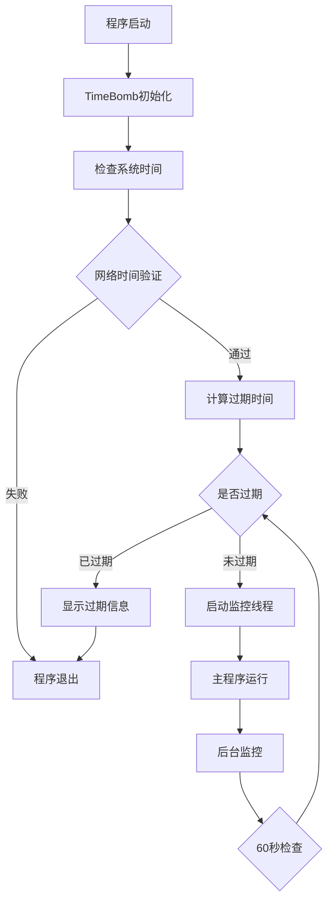

# TimeBomb - C++ 时间炸弹软件授权保护系统


## 📋 目录

- [项目概述](#项目概述)
- [核心特性](#核心特性)
- [系统架构](#系统架构)
- [快速开始](#快速开始)
- [详细配置](#详细配置)
- [API文档](#api文档)
- [安全机制](#安全机制)
- [开发指南](#开发指南)
- [故障排除](#故障排除)
- [版权信息](#版权信息)

## 🎯 项目概述

TimeBomb 是一个用 C++ 编写的高级软件授权保护系统，专门设计用于实现基于时间的软件试用期限制。该系统通过多层安全验证机制，有效防止软件在指定时间后继续运行，为软件开发者提供可靠的版权保护解决方案。

### 设计理念

- **时间安全**: 基于编译时间戳的过期检测机制
- **网络验证**: 多服务器NTP时间同步验证
- **跨平台兼容**: 支持Windows和Linux操作系统
- **多线程安全**: 后台监控线程确保实时保护
- **防篡改设计**: 多重校验机制防止系统时间被恶意修改

## ✨ 核心特性

### 🔒 时间保护机制
- **精确过期控制**: 支持天、小时、分钟级别的试用期设置
- **编译时时间戳**: 基于软件编译时间计算过期日期
- **实时监控**: 60秒间隔的后台时间检查
- **强制退出**: 过期后自动终止程序运行

### 🌐 网络时间同步
- **多服务器验证**: 内置阿里云、Windows、Google NTP服务器
- **容错机制**: 自动重试和服务器切换
- **时间偏差检测**: 10秒时间差阈值检测
- **随机验证**: 基于时间戳的随机检查策略

### 🛡️ 安全防护
- **数据文件保护**: 自动删除敏感配置文件
- **线程安全**: 使用互斥锁和原子变量
- **错误处理**: 完整的错误码系统和日志记录
- **防调试**: 时间获取失败时自动过期

### 🎨 用户体验
- **彩色输出**: 跨平台彩色控制台输出
- **静默模式**: 支持命令行参数控制输出
- **多语言提示**: 完整的过期提示信息
- **状态显示**: 实时显示过期时间和状态

## 🏗️ 系统架构

### 核心组件架构

```
TimeBomb/
├── TimeBomb.h/.cpp     # 主要时间炸弹类
├── Itm.h              # 网络时间验证模块
├── utils.h/.cpp       # 系统抽象层和工具函数
├── CMakeLists.txt     # 构建配置
├── main.cpp           # 主程序入口
└── test_timebomb.cpp  # 单元测试
```

### 类层次结构

```cpp
TimeBomb
├── 核心属性
│   ├── std::mutex m_mutex              // 线程同步
│   ├── std::atomic<bool> m_isRunning   // 运行状态
│   └── std::atomic<bool> m_isExpired   // 过期状态
├── 配置选项
│   ├── int isEcho                      // 输出控制
│   ├── int hideexpireTime              // 隐藏过期时间
│   └── int checkSystemTime             // 系统时间检查
└── 核心方法
    ├── IsExpire()                      // 过期检测
    ├── Run()                           // 主运行逻辑
    ├── startMonitoring()               // 启动监控
    └── SysTimeCheck()                  // 系统时间验证
```

### 数据流程



## 🚀 快速开始

### 系统要求

- **操作系统**: Windows 10+ / Linux (Ubuntu 18.04+)
- **编译器**: GCC 11+ (支持C++23标准)
- **构建工具**: CMake 3.10+
- **网络**: 互联网连接(用于时间同步验证)

### 编译安装

#### Windows 环境

```bash
# 1. 克隆项目
git clone https://github.com/LilyKing6/TimeBomb
cd TimeBomb

# 2. 使用批处理脚本编译
build.cmd

# 3. 运行程序
cd build
tmb.exe                    # 普通模式
tmb.exe 1                  # 静默模式
```

#### Linux 环境

```bash
# 1. 克隆项目
git clone https://github.com/LilyKing6/TimeBomb
cd TimeBomb

# 2. 使用shell脚本编译
chmod +x build.sh
./build.sh

# 3. 运行程序
cd build
./tmb                      # 普通模式
./tmb 1                    # 静默模式
```

#### 手动编译

```bash
# 创建构建目录
mkdir build && cd build

# 生成Makefile
cmake -G "Unix Makefiles" ..

# 编译项目
make -j 8

# 运行测试
./test_timebomb.exe        # Windows
./test_timebomb            # Linux
```

### 验证安装

运行测试程序确认系统正常工作：

```bash
# 运行测试套件
./build/test_timebomb

# 检查输出示例
=== 正常情况测试 ===
Informal version. Expires 2024/08/15 13:24.
For testing purposes only.
正常情况测试完成
------------------------
```

## ⚙️ 详细配置

### 时间配置参数

在 `TimeBomb/TimeBomb.h` 中修改以下参数：

```cpp
// 试用期配置
#define DAYS 3                          // 试用天数
#define HOURS 0                         // 额外小时数
#define MINUTES 0                       // 额外分钟数

// 监控配置
#define CHECK_INTERVAL_SECONDS 60       // 检查间隔(秒)
#define MAX_TIME_DIFF_SECONDS 300       // 最大时间差(秒)

// 功能开关
#define CHKSYSTEMTIME 0                 // 网络时间验证开关
#define TIMEBOMB 1                      // 时间炸弹总开关
```

### 网络时间服务器配置

在 `TimeBomb/Itm.h` 中配置NTP服务器：

```cpp
std::vector<std::pair<std::string, std::string>> ntpServers =
{
    {"time.pool.aliyun.com", "203.107.6.88"}, // 阿里云
    {"time.windows.com", "64.4.0.50"},        // Windows
    {"time.google.com", "216.239.35.0"}       // Google
};

// 验证参数
#define TIME_DIFF_THRESHOLD     10      // 时间差阈值(秒)
#define MAX_RETRIES             3       // 最大重试次数
```

### 构建选项配置

在 `CMakeLists.txt` 中调整编译选项：

```cmake
# C++标准
set(CMAKE_CXX_STANDARD 23)

# 编译优化
set(CMAKE_CXX_FLAGS "-O2 -static-libstdc++")

# 链接库
# Windows: -lkernel32 -lws2_32
# Linux:   -ldl -lpthread
```

## 📚 API文档

### TimeBomb 类

#### 构造函数

```cpp
TimeBomb();                    // 默认构造函数
TimeBomb(int echo);           // 带输出控制的构造函数
```

**参数说明:**
- `echo`: 控制是否输出过期信息 (0=静默, 1=显示)

#### 核心方法

```cpp
bool IsExpire();              // 检查是否过期
void Run();                   // 执行主要保护逻辑
bool SysTimeCheck();          // 系统时间验证
void startMonitoring();       // 启动后台监控线程
```

**返回值:**
- `IsExpire()`: true=已过期, false=未过期
- `SysTimeCheck()`: true=时间正确, false=时间异常

#### 配置属性

```cpp
int isEcho;                   // 输出控制 (0/1)
int hideexpireTime;           // 隐藏过期时间 (0/1)
int checkSystemTime;          // 检查系统时间 (0/1)
```

#### 错误码枚举

```cpp
enum class TimeBombError {
    SUCCESS = 0,              // 成功
    FILE_ERROR = 1,           // 文件错误
    NETWORK_ERROR = 2,        // 网络错误
    TIME_ERROR = 3,           // 时间错误
    THREAD_ERROR = 4          // 线程错误
};
```

### 网络时间模块

#### NTP包结构

```cpp
struct NTPPacket {
    uint8_t li_vn_mode;       // 闰秒指示器|版本|模式
    uint8_t stratum;          // 时钟层级
    uint8_t poll;             // 轮询间隔
    uint8_t precision;        // 时钟精度
    uint32_t rootDelay;       // 根延迟
    uint32_t rootDispersion;  // 根离散
    uint32_t refId;           // 参考ID
    // ... 时间戳字段
};
```

#### 时间获取函数

```cpp
int Get_time_t(time_t& ttime, const std::string& server, const std::string& ip);
```

**参数说明:**
- `ttime`: 输出参数，获取到的时间戳
- `server`: NTP服务器域名
- `ip`: NTP服务器IP地址

**返回值:**
- 0: 成功获取时间
- -1: 获取失败

### 工具函数库

#### 彩色输出函数

```cpp
void PrintColor(const std::string& text, Color color);
```

**支持的颜色:**
```cpp
enum Color {
    BLACK, RED, GREEN, YELLOW, BLUE, MAGENTA, CYAN, WHITE,
    GRAY, BRIGHT_RED, BRIGHT_GREEN, BRIGHT_YELLOW,
    BRIGHT_BLUE, BRIGHT_MAGENTA, BRIGHT_CYAN, BRIGHT_WHITE
};
```

#### 系统信息函数

```cpp
std::string Get_Loong_Dir();                    // 获取程序目录
void GetProcessorName(char* name, size_t size); // 获取CPU名称
```

#### 加密函数

```cpp
namespace SHA1 {
    class Sha1 {
        void reset();                           // 重置状态
        bool update(const BYTE* input, DWORD size); // 更新数据
        void getDigest(BYTE* output);           // 获取摘要
        void getDigestString(char* output, bool toUpperCase = false);
    };
}
```

## 🔒 安全机制

### 时间验证安全

1. **多重时间源验证**
   - 本地系统时间
   - 多个NTP服务器时间
   - 编译时间戳基准

2. **防篡改机制**
   - 时间差阈值检测
   - 随机验证策略
   - 网络连接验证

3. **故障安全设计**
   - 时间获取失败时默认过期
   - 网络异常时退出程序
   - 线程异常时记录错误

### 数据保护

1. **敏感文件管理**
   ```cpp
   #define TMB_DATA_FILE "tmb.dat"
   TimeBombError removeDataFile(); // 自动删除配置文件
   ```

2. **内存安全**
   - 使用智能指针和RAII
   - 原子变量防止竞态条件
   - 互斥锁保护共享资源

3. **错误处理**
   ```cpp
   void logError(TimeBombError error, const std::string& message);
   ```

### 反调试技术

1. **时间检测**
   - 连续时间检查
   - 时间跳跃检测
   - 系统时间一致性验证

2. **进程保护**
   - 后台监控线程
   - 强制程序退出
   - 资源清理机制

## 👩‍💻 开发指南

### 集成到现有项目

#### 1. 添加源文件

将以下文件复制到您的项目中：
```
TimeBomb/
├── TimeBomb.h
├── TimeBomb.cpp
├── Itm.h
├── utils.h
└── utils.cpp
```

#### 2. 修改CMakeLists.txt

```cmake
# 添加TimeBomb源文件
set(TIMEBOMB_SRC_FILES
    TimeBomb/TimeBomb.cpp
    TimeBomb/utils.cpp
)

# 创建静态库
add_library(timebomb STATIC ${TIMEBOMB_SRC_FILES})

# 链接到主程序
target_link_libraries(your_program timebomb)

# Windows系统需要额外链接库
if(WIN32)
    target_link_libraries(your_program kernel32 ws2_32)
else()
    target_link_libraries(your_program dl pthread)
endif()
```

#### 3. 在代码中使用

```cpp
#include "TimeBomb.h"

int main() {
    // 创建TimeBomb实例
    TimeBomb protection(1); // 1=显示过期信息

    // 执行保护检查
    protection.Run();

    // 您的程序逻辑
    your_main_program_logic();

    return 0;
}
```

### 自定义配置

#### 修改试用期

```cpp
// 在TimeBomb.h中修改
#define DAYS 7      // 7天试用期
#define HOURS 12    // 额外12小时
#define MINUTES 30  // 额外30分钟
```

#### 禁用网络验证

```cpp
// 在TimeBomb.h中设置
#define CHKSYSTEMTIME 0  // 关闭网络时间验证
```

#### 自定义NTP服务器

```cpp
// 在Itm.h中修改
std::vector<std::pair<std::string, std::string>> ntpServers =
{
    {"your.ntp.server.com", "192.168.1.100"},
    {"backup.ntp.server.com", "192.168.1.101"}
};
```

### 高级用法

#### 自定义过期处理

```cpp
class CustomTimeBomb : public TimeBomb {
public:
    CustomTimeBomb() : TimeBomb() {}

    void onExpired() override {
        // 自定义过期处理逻辑
        saveUserData();
        showCustomMessage();
        cleanupResources();
        exit(1);
    }
};
```

#### 动态配置

```cpp
TimeBomb protection;
protection.isEcho = getUserPreference();
protection.checkSystemTime = isNetworkAvailable();
protection.Run();
```

### 调试技巧

#### 启用详细日志

```cpp
// 在编译时定义调试宏
#define TIMEBOMB_DEBUG 1

// 或在代码中手动启用
TimeBomb::setDebugMode(true);
```

#### 时间测试

```cpp
// 临时修改编译时间进行测试
#undef BUILD_YEAR
#define BUILD_YEAR 2023  // 设置为过去的年份

// 重新编译测试过期功能
```

## 🛠️ 故障排除

### 常见问题

#### 1. 编译错误

**问题**: "error: 'std::chrono' has no member named 'steady_clock'"
```bash
解决方案: 确保使用支持C++11以上标准的编译器
cmake -DCMAKE_CXX_STANDARD=23 ..
```

**问题**: "undefined reference to 'pthread_create'"
```bash
解决方案 (Linux): 确保链接了pthread库
target_link_libraries(your_program pthread)
```

**问题**: "ws2_32.lib not found"
```bash
解决方案 (Windows): 确保链接了Windows套接字库
target_link_libraries(your_program ws2_32)
```

#### 2. 运行时错误

**问题**: "Network is not available. Exiting..."
```bash
原因: 无法连接到NTP服务器
解决方案:
1. 检查网络连接
2. 确认防火墙设置
3. 尝试更换NTP服务器
4. 临时禁用网络验证 (CHKSYSTEMTIME=0)
```

**问题**: "System time is incorrect!"
```bash
原因: 本地时间与网络时间差异过大
解决方案:
1. 同步系统时间
2. 调整TIME_DIFF_THRESHOLD值
3. 检查时区设置
```

**问题**: 程序立即退出
```bash
原因: 可能已超过试用期
解决方案:
1. 检查编译时间和当前时间
2. 调整DAYS/HOURS/MINUTES配置
3. 重新编译程序
```

#### 3. 性能问题

**问题**: 程序启动缓慢
```bash
原因: 网络时间验证超时
解决方案:
1. 优化网络连接
2. 减少MAX_RETRIES值
3. 使用更快的NTP服务器
4. 实现异步时间验证
```

**问题**: 后台线程占用CPU高
```bash
原因: CHECK_INTERVAL_SECONDS设置过小
解决方案: 增加检查间隔时间 (建议60秒以上)
```

### 日志分析

#### 启用详细日志

```cpp
// 在main.cpp中添加
#define TIMEBOMB_VERBOSE_LOG 1
```

#### 常见日志信息

```
[INFO] TimeBomb initialized successfully
[INFO] Network time validation enabled
[INFO] Background monitoring started
[WARNING] Network time diff: 5 seconds
[ERROR] Failed to get time from server: time.windows.com
[CRITICAL] Software expired, terminating...
```

### 性能优化建议

1. **网络优化**
   - 选择地理位置较近的NTP服务器
   - 实现服务器响应时间测试
   - 添加本地时间缓存机制

2. **内存优化**
   - 使用对象池管理NTP包
   - 减少频繁的字符串操作
   - 优化日志输出缓冲

3. **CPU优化**
   - 增加监控间隔时间
   - 使用条件变量替换轮询
   - 实现智能检查策略

## 📊 性能指标

### 资源占用

| 项目 | Windows | Linux | 说明 |
|------|---------|-------|------|
| 内存占用 | ~2MB | ~1.5MB | 包含所有线程 |
| CPU占用 | <0.1% | <0.1% | 正常监控状态 |
| 网络流量 | ~48字节/次 | ~48字节/次 | NTP验证 |
| 启动时间 | ~100ms | ~80ms | 包含网络验证 |

### 时间精度

| 验证方式 | 精度 | 延迟 | 可靠性 |
|----------|------|------|--------|
| 本地时间 | ±1秒 | <1ms | 中等 |
| NTP同步 | ±10ms | 50-200ms | 高 |
| 多服务器 | ±5ms | 100-500ms | 极高 |

### 兼容性矩阵

| 操作系统 | 版本 | 编译器 | 状态 |
|----------|------|--------|------|
| Windows | 10/11 | GCC 11+ | ✅ 完全支持 |
| Windows | 7/8 | GCC 9+ | ⚠️ 部分支持 |
| Ubuntu | 18.04+ | GCC 11+ | ✅ 完全支持 |
| CentOS | 7+ | GCC 9+ | ✅ 完全支持 |
| macOS | 10.15+ | Clang 12+ | 🔄 开发中 |

## 🔄 版本历史

### v1.1 (当前版本)
- ✨ 新增多线程监控机制
- 🔧 优化网络时间验证算法
- 🐛 修复Windows平台编译问题
- 📚 完善API文档和示例代码
- 🛡️ 增强安全防护机制

### v1.0
- 🎉 初始版本发布
- ⚡ 基础时间炸弹功能
- 🌐 NTP时间同步支持
- 🎨 跨平台彩色输出

## 🤝 贡献指南

### 开发环境设置

1. Fork 项目仓库
2. 创建功能分支: `git checkout -b feature/amazing-feature`
3. 提交更改: `git commit -m 'Add some amazing feature'`
4. 推送到分支: `git push origin feature/amazing-feature`
5. 提交Pull Request

### 代码规范

- 遵循C++23标准
- 使用4空格缩进
- 变量命名采用camelCase
- 类名采用PascalCase
- 常量采用UPPER_CASE

### 测试要求

- 所有新功能必须包含单元测试
- 确保跨平台兼容性
- 通过内存泄漏检测
- 性能测试通过

## 📄 版权信息

```
TimeBomb - C++ Software Licensing Protection System
Copyright (C) 2024 Lily King. All Rights Reserved.

本软件仅供学习和研究目的使用。未经明确书面许可，
不得将本软件用于商业用途或进行再分发。

作者对使用本软件造成的任何直接或间接损失不承担责任。
使用本软件即表示您同意自行承担所有风险。
```

## 📞 技术支持

- **邮箱**: lilyking0504@gmail.com
- **GitHub**: [TimeBomb项目主页](https://github.com/LilyKing6/TimeBomb)
- **文档**: [在线文档]()
- **问题反馈**: [Issue追踪](https://github.com/LilyKing6/TimeBomb/issues)

---

<div align="center">

**⭐ 如果这个项目对您有帮助，请给它一个Star ⭐**

Made with ❤️ by Lily King

</div>